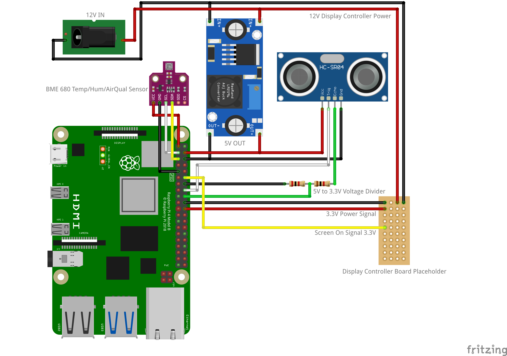

# HC-SR04-Sonar-Screen-Controller
 A simple sonar distance script/service meant to trigger on/off signal pulses to a lcd screen controller board.
 Meant for use with: `https://github.com/EvanGuanSF/ElectronReactWeatherApp`

 Usage requires elevated permissions (sudo) to install/remove systemd service files.

 
